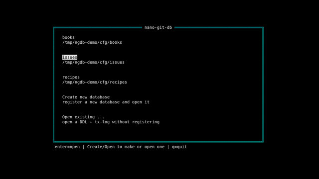
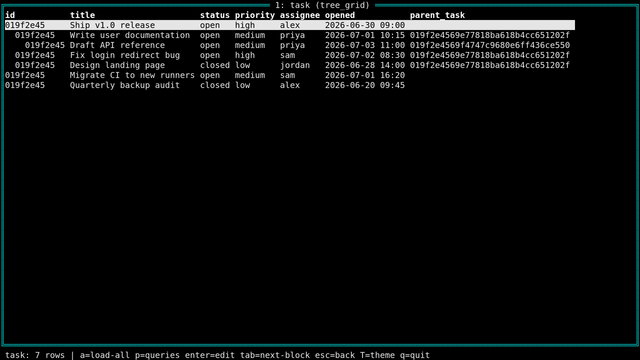
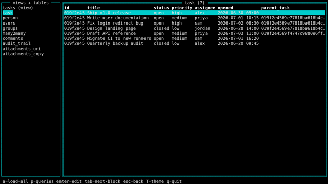
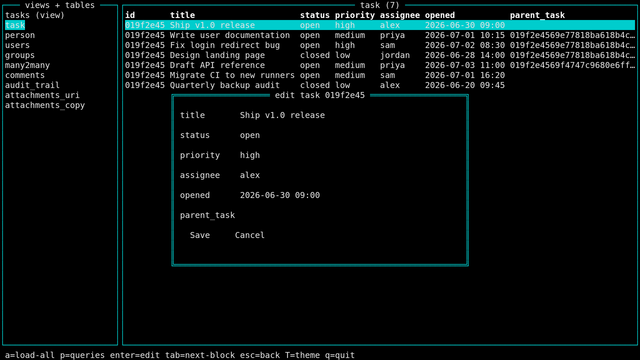
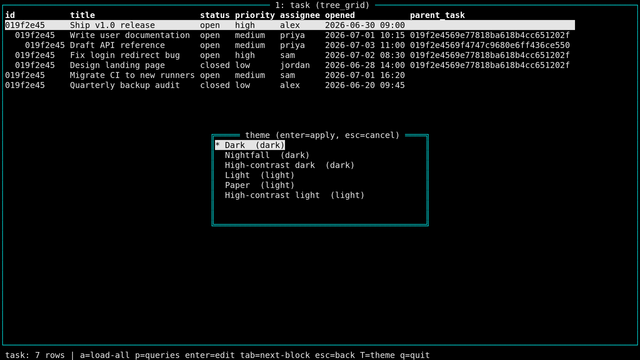

<!-- markdownlint-disable MD007 -- Unordered list indentation -->
<!-- markdownlint-disable MD010 -- No hard tabs -->
<!-- markdownlint-disable MD033 -- No inline html -->
<!-- markdownlint-disable MD055 -- Table pipe style [Expected: leading_and_trailing; Actual: leading_only; Missing trailing pipe] -->
<!-- markdownlint-disable MD041 -- First line in a file should be a top-level heading -->
<div align="center">


[](LICENSE)


</div>
<!--
[](https://www.gnu.org/software/bash/)
[](https://www.python.org/)
[](https://


[](https://www.javascript.com)


[](https://opensource.org/licenses/MIT)
[](https://opensource.org/licenses/MPL-2.0)


-->

<!-- TOC ignore:true -->
# Nano Git DB

<table style="border: none; border-collapse: collapse;">
	<tr style="border: none; border-collapse: collapse;">
		<td style="border: none; border-collapse: collapse;"></td>
		<td style="border: none;">Nano Git DB is a tiny, simple, yet powerful distributed multi-user database.<br /><br />A separately licensed enterprise edition adds encrypted data, so the git host cannot read it, plus Lua scripting for triggers and automation.<br /><br />The database schema uses an easy, user-friendly text-based DDL; no SQL knowledge necessary. A single small executable contains the CLI, TUI, and web interfaces (use any or all).<br /><br />The database schema can be modified at will, while all data remains backward and forward compatible.<br /><br />Any number of databases can be run concurrently on a machine. Git is used for the "distributed" feature. (And Nano Git DB is perfect for a more robust team issue tracking database for each git repo - and just such a schema is included as a useful example.)<br /><br />But git is not required for local-only use, nor for server-hosted web browser access.<br /><br />Runs on Linux, Windows, macOS.</td>
	</tr style="border: none; border-collapse: collapse;">
</table>

<!--
	<p align="center"></p>
	This is a thing.
-->


<!-- TOC ignore:true -->
## Table of contents

<!-- TOC -->

- [Why](#why)
- [Features](#features)
- [Enterprise edition](#enterprise-edition)
- [The very few files involved](#the-very-few-files-involved)
- [Example use-cases](#example-use-cases)
- [Installing](#installing)
- [Building from source](#building-from-source)
- [Quick start](#quick-start)
	- [A minimal schema](#a-minimal-schema)
	- [A minimal to-do database](#a-minimal-to-do-database)
	- [Basic CLI](#basic-cli)
- [Full syntax reference](#full-syntax-reference)
- [Support nano-git-db](#support-nano-git-db)
- [Copyright and license](#copyright-and-license)

<!-- /TOC -->

## Why

Why indeed, when:

- There are a possibly hundreds "tiny databases" out there.
- There are maybe dozens of databases that can work across a team or teams, via git.
- There are countless databases that can be defined and managed without SQL, including those that opt for a user-friendly text-based DDL.
- There are uncountable databases that run as a single, small, cross-platform executable. (Plus the database file.)

But: None embody all of those at the same time.

## Features

- Can sync records across multiple users, and auto-resolve conflicts, via `git`.

- Any number of databases are supported (all at the same with multiple running tiny instances).

- Git is not required - it can also work independently as a single-user database. (And even as a server via built-in web server.)

- One small executable contains:

	- A full CRUD command-line interface
	- A full CRUD TUI interface
	- A full CRUD self-hosting local web UI. (That can be used locally, and/or shared to the network.)

- SQLite3 is used as the back-end. (The `.sqlite` file is not synced via git though, it is stored outside the repo.)

- A text file is used separately, as a transaction log for git syncing/auto-merging. The executable regularly checks it for updates, and exports local updates to it as they happen. Changes to the file are imported to the local `.sqlite` database, that all the interfaces use.

- The database is created - and can be continuously managed - via a text file with a simple DDL language, in YAML format.

- The schema can change at any time. Old and new records stay compatible in both directions, so you never have to migrate.

- Tables and fields can be renamed without losing or rewriting existing history.

- Views arrange your data on screen, including nested and hierarchical lists such as a task tree or an outline.

- Saved queries live next to the schema and can be picked from a menu.

- Any table can opt in to extras: a comment list per record, an automatic audit trail of every change, and file or link attachments.

- Users and groups with permissions down to the table, field, and row level.

- Old deleted records are cleaned out of the log automatically, so it does not grow forever.

- Register your databases once and pick from a list at startup.

- One small static binary with no external dependencies. Runs on Linux, Windows, and macOS.

## Enterprise edition

nano-git-db is open source and complete on its own. A separately licensed enterprise edition adds features that some teams need, built into the same single binary.

- At-rest encryption of field values in the synced log. The git host cannot read your data, while your local database stays fully queryable. Each database has its own key, kept out of the repo, with a simple per-field, per-table, or per-database policy set by an `encryption: always|never|auto` DDL key.

- Lua scripting. Run a script against the database with `--script`, and attach triggers and stored procedures to tables and fields through the DDL's code: keys. Scripts reach the data only through the same safe database calls the rest of the program uses.

- Planned: a REST API for network access.

- Planned: sign-in for the shared web UI, with passwords, an authenticator app, passkeys, and optional Google, Microsoft, or LinkedIn login.

The open-source build can share and sync an encrypted database, but only the enterprise build can read and write the encrypted fields.

## Screenshots

The terminal UI, shown with an example team issue tracker. Click any image for the full-size version.

<p align="center">
	<a href="assets/screenshots/large/1-picker.png"></a>
	<a href="assets/screenshots/large/2-view.png"></a>
	<a href="assets/screenshots/large/3-table.png"></a>
	<a href="assets/screenshots/large/4-form.png"></a>
	<a href="assets/screenshots/large/5-theme.png"></a>
</p>

## The (very few) files involved

These files can go anywhere, this is just the suggested/default location. (This describes the target layout; pre-1.0, paths are passed explicitly on the command line.)

Required and/or auto-generated:

- `/usr/local/bin/ngdb`
	- The one and only executable.

- `./repo/ngdb/the-instance-name/txlog.csv`
	- The transaction log - the source of truth, updated by all clients, synced and auto-reconciled by git (if using git).
	- Doesn't have to be in this location, just somewhere in a git repo if you want syncing.
	- The program periodically syncs this, so that you're working with fresh data.

- `./repo/ngdb/the-instance-name/schema.ddl`
	- Your database schema definition file.
	- It gracefully accepts local or synced additions and changes to the DDL: new fields/tables are migrated into the local database live, and previous transactions are not affected.

- `./repo/ngdb/the-instance-name/config.toml`
	- Repo-specific settings. (Planned - see the tunable-options backlog item.)

- `~/.local/share/ngdb/the-instance-name/db.sqlite`
	- The local database - a derived, rebuildable view of the transaction log. Changes come from and go to the log every time it syncs, but you're working with this database.

<!--
| File | Description
| :--  | :--
| `./repo/ngdb/the-instance-name/shared-transactions.log`              | The main record that gets updated by all clients, and synced and auto-reconciled by git (if using git).
| `./repo/ngdb/the-instance-name/schema.ddl`                           | The table definition file. Upon program startup, it gracefully accepts additions, deletions, and changes to the DDL. Previous transactions are not affected.
| `./repo/ngdb/the-instance-name/config.toml`                          | Repo-specific settings.
| `~/.local/share/ngdb/the-instance-name/db.sqlite`          | The local database.
-->

Optional (planned - see the predefined-queries backlog item):

- `./repo/the-instance-name/named-queries.txt`
	- Synced predefined named queries, available to everyone.

- `/etc/ngdb/the-instance-name/named-queries.txt`
	- Predefined named queries, available only to the local machine.

- `~/.local/share/ngdb/the-instance-name/named-queries.txt`
	- Predefined named queries, available only to the local user.

## Example use-cases

- A project lead can create a small issue tracking database to share with the the entire team, via the shared git repo. (With separate databases per repo.)
	- Issue management can be automated via command-line API, and/or managed by each user with the TUI (even over SSH), a central web UI, or a per-user local-only web UI.

- Github projects can have more robust issue tracking (or any number of arbitrary databases), that repo users only have to install a single small executable to participate with.

## Installing

Grab a release binary (once releases start), or build from source. It's one static executable, so installing is just copying it anywhere on your `PATH`. (`go install` is not supported: the Go module root deliberately lives under `source/` to keep the repo root clean.)

## Building from source

`./cicd/build.bash` produces a size-optimized, fully static `./bin/ngdb`. Requirements: Go only - `CGO_ENABLED=0` and committed vendored dependencies mean no C toolchain and no network. Cross-compile by exporting `GOOS`/`GOARCH` first (pure Go, so every target builds from any machine).

## Quick start

You define the database in a plain-text schema file (the DDL). No SQL, no migrations - you edit the file, and the local database migrates itself. Three files matter: your `schema.ddl`, a tx-log directory (the shared source of truth, git-syncable), and a local `.sqlite` (a rebuildable view - never synced). The examples below pass all three explicitly; once a database is registered, the TUI can just show you a picker (see [Startup discovery](syntax.md#startup-discovery-and-the-database-registry)).

### A minimal schema

The whole grammar is indent-nested `key: value` lines, one tab per level. A table is a name and its fields:

```
database:
	tables:
		table: task
			fields:
				field: title
					type: string
				field: status
					type: string
```

That is a complete, working schema. Every table also gets `id`, `is_active`, `date_created`, and a hidden `is_deleted` for free.

### A minimal to-do database

A slightly fuller example: hierarchical tasks (each task can have a parent task) that each carry their own list of comments, shown as a nested list. Save it as `todo.ddl`:

```
## Minimal to-do database: hierarchical tasks, each with a comment list.

database:
	tables:
		table: task
			fields:
				field: title
					type: string
				field: status
					type: string
				field: opened
					type: datetime_local
				field: closed
					type: datetime_local
				field: parent_task
					type: string  ## a parent task's id; empty for a top-level task
			features:
				comments: yes    ## each task gets its own list of comments

ui:
	views:
		view: "tasks"
			layout:
				block: "tree"
					table: task
					type: tree_grid       ## the nested list, ordered by parent_task
					parent_field: parent_task
	default_view: "tasks"
```

`tree_grid` + `parent_field` is what makes the task list hierarchical: a task whose `parent_task` holds another task's id nests under it; an empty `parent_task` is a top-level task. `features: comments: yes` gives each task its own related comment list.

### Basic CLI

Every data verb takes the same `<ddl> <sqlite> <logdir>` trio (here `.` is the tx-log dir - the current directory), then its own arguments. Working with the `todo.ddl` above:

```
# build the local view from the schema
ngdb build todo.ddl todo.sqlite

# add a top-level task; the command prints the new row's id
ngdb create todo.ddl todo.sqlite . task title="Ship v1" status=open

# add a subtask under it (paste the parent id from above)
ngdb create todo.ddl todo.sqlite . task title="Write docs" parent_task=<parent-id>

# add a comment to a task, then list its comments
ngdb comment  todo.ddl todo.sqlite . task <id> "kickoff notes"
ngdb comments todo.ddl todo.sqlite . task <id>

# read it back
ngdb query todo.ddl todo.sqlite . "SELECT title, status FROM task WHERE is_deleted = 0"
```

Prefer a UI? `ngdb --tui todo.ddl todo.sqlite .` opens the terminal UI over the same database, and `ngdb --serve todo.ddl todo.sqlite .` serves a local web UI on `127.0.0.1:8765`.

Tired of typing paths? Run `ngdb --init` in the directory with your `todo.ddl` to register it; after that, a bare `ngdb` shows a picker of your databases (or run `--init` inside a git repo to auto-place the synced tx-log under it). See [Startup discovery](syntax.md#startup-discovery-and-the-database-registry).

## Full syntax reference

The complete DDL, sidecar-file (named queries, triggers), CLI, run-mode, access-model, and registry reference lives in [syntax.md](syntax.md).

## Support nano-git-db

nano-git-db is free and open source. If it is useful to you, please consider supporting its development - see [DONATE.md](DONATE.md) for ways to help.

## Copyright and license

> Copyright © 2025-26 Jim Collier (ID: 1cv◂‡Vᛦ)<br />
> Licensed under the [GNU Affero General Public License v3.0](LICENSE) (`AGPL-3.0-only`). No warranty.

The AGPL's network-use clause is deliberate. If you run a modified nano-git-db as a network service, you must offer users your source. A separately licensed enterprise edition is also available under different terms. Outside contributions need a signed [Contributor License Agreement](CLA.md). See [contributing.md](contributing.md).
<!--
> Licensed under the [MIT License](https://mit-license.org/). No warranty.
> Licensed under the [GNU General Public License v2.0](https://www.gnu.org/licenses/gpl-2.0.html). No warranty.
> Licensed under the [GNU General Public License v2.0 or later](https://spdx.org/licenses/GPL-2.0-or-later.html). No warranty.
> Licensed under the [GNU General Public License v3](https://www.gnu.org/licenses/gpl-3.0.en.html) license. No warranty.
> Licensed under the [Mozilla Public License 2.0](https://mozilla.org/MPL/2.0/). No warranty.
-->