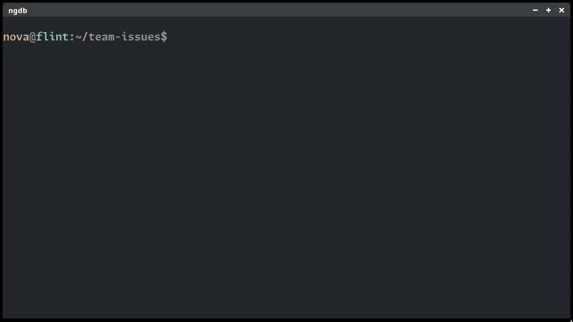

<!-- markdownlint-disable MD007 -- Unordered list indentation -->
<!-- markdownlint-disable MD010 -- No hard tabs -->
<!-- markdownlint-disable MD033 -- No inline html -->
<!-- markdownlint-disable MD055 -- Table pipe style [Expected: leading_and_trailing; Actual: leading_only; Missing trailing pipe] -->
<!-- markdownlint-disable MD041 -- First line in a file should be a top-level heading -->
<div align="center">


[](https://github.com/jim-collier/nano-git-db/actions/workflows/ci.yml)
[](https://github.com/jim-collier/nano-git-db/releases/latest)
[](license.md)


<!-- TOC ignore:true -->
# Nano Git DB


A multi-user database you sync with `git`. No server, no SQL, and one static binary that gives you a command line, a terminal UI, and a local web UI.

The database itself is a folder of append-only text. When two people edit at once, git merges it the way it merges any text file - and because each write is its own line, that merge happens field by field instead of clobbering a record.



<sub>The terminal UI, then the same database from the shell.</sub>

</div>

It scales down to one person with no remote at all, and up to a team spread across the world.

<!-- TOC ignore:true -->
## Table of contents

<!-- TOC -->

- [Why another database?](#why-another-database)
- [Features](#features)
- [Enterprise edition](#enterprise-edition)
- [What a database is, on disk](#what-a-database-is-on-disk)
- [Example use cases](#example-use-cases)
- [Installation](#installation)
	- [Packages and installers](#packages-and-installers)
	- [Install script](#install-script)
	- [Do it yourself](#do-it-yourself)
- [Quick start](#quick-start)
	- [A minimal schema](#a-minimal-schema)
	- [A minimal to-do database](#a-minimal-to-do-database)
	- [Basic CLI](#basic-cli)
- [Set up a development environment](#set-up-a-development-environment)
- [Full syntax reference](#full-syntax-reference)
- [Support nano-git-db](#support-nano-git-db)
- [Copyright and license](#copyright-and-license)

<!-- /TOC -->

## Why another database?

Plenty of tools each do some of these. None do all of them at once:

- Tiny and local, one small binary that serves the CLI, TUI, and local web UI.

- Multi-user, synced across a team via `git` - with "conflicts" (the expected norm) auto-merged per-field, in an unsurprising way.

- Defined without SQL, in a friendly text schema you edit by hand. (But supports the full SQL syntax and indexes for queries.)

- Stored as human-readable text you can diff, grep, review, and back up like any other file.

- Changes to the schema are backwards and forwards compatible by definition. No data is ever lost.

`nano-git-db` is all of them.

## Features

- Syncs records across people and auto-merges their changes with `git`.

- Git is optional. On its own it's a fast local single-user database, or a self-hosted web app.

- One small static binary, no external dependencies - three front-ends over one shared core:
	- a full CRUD command line,
	- a terminal UI that works fine over SSH, with built-in light and dark themes,
	- a self-hosted web UI, local-only or shared to your network with password sign-in.
- Schema defined in a plain text file - indent-nested `key: value` lines, no SQL to write.

- Change the schema anytime. Old and new records stay compatible both ways, so there's never a migration.

- Rename tables and fields without losing or rewriting history.

- Views, including hierarchical tree grids - a task tree, an outline, a threaded board.

- Saved queries kept next to the schema and picked from a menu.

- Per-table extras, opt-in: a comment thread per record, an automatic audit trail of every change, and file or link attachments.

- Users and groups, with permissions down to the table, field, and row.

- A `gc` pass drops the log entries of long-deleted records, so the history doesn't grow forever.

- Register a database once, then refer to it by name and pick from a list at startup.

- SQLite under the hood as a rebuildable local view - the `.sqlite` file stays out of the repo; only the text log is synced.

- Prebuilt for Linux, Windows, macOS and FreeBSD, on both x86-64 and ARM64.

## Enterprise edition

`nano-git-db` is open source and complete on its own. A separately licensed enterprise edition adds features some teams need, built into the same single binary.

- At-rest post-quantum encryption of field values in the synced log. The git host can't read your data, while your local database stays fully queryable. Each database has its own key, kept out of the repo, with a per-field, per-table, or per-database policy set by an `encryption: always|never|auto` DDL key.

- Lua scripting. Run a script against the database with `--script`, or attach triggers and stored procedures to tables and fields through the DDL's `code:` keys. Scripts reach the data only through the same safe calls the rest of the program uses.

- Coming soon:

	- Guaranteed leak-proof team and organization enforcement, based on (post-quantum) asymmetric encryption.

	- More secure login mechanisms for the web server including 2FA and Passkey authentication, and optional third-party login token support (e.g. Google, Microsoft, etc.). Basic password sign-in is already in the open-source build.

	- REST API for application integration, custom front-ends, and mobile support.

	- iOS and Android mobile applications.

The open-source build can share and sync an encrypted database, but only the enterprise build can read and write the encrypted fields.

The existing functionality and feature set in this open-source version will never shrink or be nerfed (only grow and improve). This version will always be free and open-source. (As required by the license. And this project can be forked for preservation at any time - public repos help keep promises like these honest.)

## What a database is, on disk

A database is just a few files. You register it once with `ngdb --init`, then refer to it by name - ngdb keeps track of the paths.

- `schema.shcl` - your schema. Keep it with your project, inside the git repo if you want syncing. Edit it anytime; the local database migrates itself.
- `txlog.csv` - the append-only transaction log (a folder of segments). The source of truth, synced and auto-merged by git. For sharing, this *is* the database.
- `<name>.queries.shcl` - optional saved queries, next to the schema.
- `db.sqlite` - the local, rebuildable view of the log. Derived, never synced, kept outside the repo (next to the registry record, under your OS config dir).
- `config.shcl` - ngdb's own registry record for the database, in your OS config dir. Written by `--init`; you won't normally touch it.
- `ngdb` - the one binary, anywhere on your `PATH`.

## Example use cases

- A team issue tracker, one per git repo, shared through the same repo the code lives in. Automate it from the command line, or let each person use the TUI (even over SSH), a shared web UI, or their own local-only web UI. A ready-to-run issue-tracker schema is included in [`demos/`](demos/).
- Any small shared database a GitHub project wants its contributors to keep - they install one small binary to take part, and it rides along in the repo.

## Installation

`ngdb` is a single static executable with nothing to configure and no runtime to install. Any of these gets you one.

### Packages and installers

Pick your platform from the [latest release](https://github.com/jim-collier/nano-git-db/releases/latest):

| Platform | What to download
| :--      | :--
| Debian, Ubuntu | `ngdb_<version>_linux_<arch>.deb`
| Fedora, RHEL, openSUSE | `ngdb_<version>_linux_<arch>.rpm`
| Windows | `ngdb-<version>-windows-<arch>-setup.exe` (updates an existing install in place)
| macOS, FreeBSD, other Linux | the matching `.tar.gz`, then copy `ngdb` onto your `PATH`

Every release also carries a `checksums.txt` if you'd like to verify what you downloaded.

### Install script

The script picks the right build, checks it against the published checksum, tells you what it is about to do, and asks first. Re-running it is safe - an install already at the newest version is left alone.

Linux, macOS, FreeBSD, WSL:

```bash
bash <(curl -fsSL https://raw.githubusercontent.com/jim-collier/nano-git-db/main/install.bash)
```

Windows, or anywhere with PowerShell 7:

```powershell
& ([scriptblock]::Create((irm 'https://raw.githubusercontent.com/jim-collier/nano-git-db/main/install.ps1')))
```

Both accept the same options:

| Option | Effect
| :--    | :--
| `--release stable` / `-Release stable` | the newest full release (the default, when one exists)
| `--release dev` / `-Release dev` | the newest release of any kind, pre-releases included
| `--target user` / `-Target user` | install for you alone (the default)
| `--target system` / `-Target system` | install for everyone; asks for sudo, or needs an elevated session
| `--arch x64\|arm64` / `-Arch x64\|arm64` | override the detected CPU architecture
| `--list` / `-List` | show the available releases and stop
| `--yes` / `-Yes` | skip the confirmation prompt

Where it puts things:

| OS | User install | System install
| :-- | :-- | :--
| Linux, macOS, FreeBSD | `~/.local/bin/ngdb` | `/usr/local/bin/ngdb`
| Windows | `%LOCALAPPDATA%\Programs\ngdb\ngdb.exe` | `%ProgramFiles%\ngdb\ngdb.exe`

The Windows user install adds its directory to your `PATH`; the others assume the standard local `bin` is already there.

### Do it yourself

Copy the executable anywhere on your `PATH` - that is the whole install. To build it instead, see [Set up a development environment](#set-up-a-development-environment).

`go install` is not supported: the Go module lives under `source/` to keep the repo root readable, so its path doesn't match its location in the repo.

## Quick start

You define the database in a plain-text schema file (the DDL). No SQL, no migrations - you edit the file, and the local database migrates itself. Under the hood three things matter: your `schema.shcl`, a tx-log directory (the shared source of truth, git-syncable), and a local `.sqlite` (a rebuildable view - never synced). You register those once and then just refer to the database by name; ngdb keeps track of the paths (see [Startup discovery](syntax.md#startup-discovery-and-the-database-registry)).

### A minimal schema

The schema is written in [SHCL](https://github.com/jim-collier/shcl): indent-nested `key: value` lines, one tab per level. A table is a name and its fields:

```
database:
	tables:
		table: task
			fields:
				field: title
					type: string
				field: status
					type: string
```

That is a complete, working schema. Every table also gets `id`, `is_active`, `date_created`, and a hidden `is_deleted` for free.

### A minimal to-do database

A slightly fuller example: hierarchical tasks (each task can have a parent task) that each carry their own list of comments, shown as a nested list. Save it as `todo.shcl`:

```
## Minimal to-do database: hierarchical tasks, each with a comment list.

database:
	tables:
		table: task
			fields:
				field: title
					type: string
				field: status
					type: string
				field: opened
					type: datetime_local
				field: closed
					type: datetime_local
				field: parent_task
					type: ref  ## a parent task's id; empty for a top-level task
			features:
				comments: yes    ## each task gets its own list of comments

ui:
	views:
		view: "tasks"
			layout:
				block: "tree"
					table: task
					type: tree_grid       ## the nested list, ordered by parent_task
					parent_field: parent_task
	default_view: "tasks"
```

`tree_grid` + `parent_field` is what makes the task list hierarchical: a task whose `parent_task` holds another task's id nests under it; an empty `parent_task` is a top-level task. `features: comments: yes` gives each task its own related comment list.

### Basic CLI

Register your schema once, then refer to the database by name - you never spell out the schema, view, or log paths again:

```
# register the todo.shcl in this directory as the database "todo"
ngdb --init

# add a top-level task; the command prints the new row's id
ngdb create todo task title="Ship v1" status=open

# add a subtask under it (paste the parent id from above)
ngdb create todo task title="Write docs" parent_task=<parent-id>

# add a comment to a task, then list its comments
ngdb comment  todo task <id> "kickoff notes"
ngdb comments todo task <id>

# read it back
ngdb query todo "SELECT title, status FROM task WHERE is_deleted = 0"
```

The database name is the first argument; if you'd rather be explicit, `--db=todo --table=task` flags work in any order too. Run a bare `ngdb` to see a picker of your registered databases.

Prefer a UI? `ngdb --tui todo` opens the terminal UI over that database, and `ngdb --serve todo` serves a local web UI on `127.0.0.1:8765`. Run `--init` inside a git repo to auto-place the synced tx-log under it. See [Startup discovery](syntax.md#startup-discovery-and-the-database-registry).

## Set up a development environment

Building needs Go and nothing else. Dependencies are vendored into the repo and `CGO_ENABLED=0` is set, so there is no C toolchain to install and no network fetch during a build.

Prerequisites:

- Go 1.25 or newer. `source/go.mod` pins the exact toolchain, which Go fetches on its own if you don't have it.
- `git`, for the repo and for the sync feature's own tests.

Build and test:

```bash
git clone https://github.com/jim-collier/nano-git-db
cd nano-git-db

# size-optimized static binary at ./bin/ngdb
./cicd/build.bash

# from source/, the module root
cd source
go test -mod=vendor ./...
go vet  -mod=vendor ./...
gofmt -l cmd internal        # must print nothing
```

Cross-compile by exporting `GOOS` and `GOARCH` before `./cicd/build.bash`. Every target builds from any machine, because it is all pure Go.

`./cicd/cicd.bash` runs the full local pipeline: build, lint, test, fuzz, a vulnerability and security scan, a profiling pass, and packaging. `--quick` skips the slow stages. Its extra tools are fetched on demand by `go run`, except the flamegraph renderer (`cargo install inferno`), which the profiling stage skips if missing.

Contributions are welcome - see [contributing.md](contributing.md).

## Full syntax reference

The complete DDL, sidecar-file (named queries, triggers), CLI, run-mode, access-model, and registry reference lives in [syntax.md](syntax.md).

## Support nano-git-db

`nano-git-db` is written and maintained by one programmer in his spare time. If you use it often, or it saves you time, sponsoring it keeps it moving.

Even a few dollars a month is meaningful. Or just buy me a coffee.

**Direct support**

- [GitHub Sponsors](https://github.com/sponsors/jim-collier)

**Indirect support**

- Star the repo.
- File good bug reports and feature requests.

**Get the word out**

Tell other developers and teams about it wherever you hang out.

- [r/git](https://www.reddit.com/r/git/)
- [Hacker News](https://news.ycombinator.com)
- [r/selfhosted](https://www.reddit.com/r/selfhosted/)

## Copyright and license

> Copyright © 2025-26 Jim Collier (ID: 1cv◂‡Vᛦ)<br />
> Licensed under the [GNU Affero General Public License v3.0](license.md) (`AGPL-3.0-only`). No warranty.

The AGPL's network-use "SaaS" clause (what specifically differentiates it from regular GPL) is deliberate. If you run a modified `nano-git-db` as a network service - which anyone is free and encouraged to do - you must offer users your source so that others can continue to build on your work, and so on.

Separately from that, a licensed enterprise edition is also available under different terms. Therefore, as with *all* "Community/Commercial" or "FLOSS/Enterprise" projects like this - including all the big ones you know like Red Hat, Kubernetes, VSCode, WordPress, MongoDB, GitLab - outside contributions must legally sign a [Contributor License Agreement](CLA.md) for the model to work, and therefore to be able to contribute code in the first place. See [contributing.md](contributing.md).
